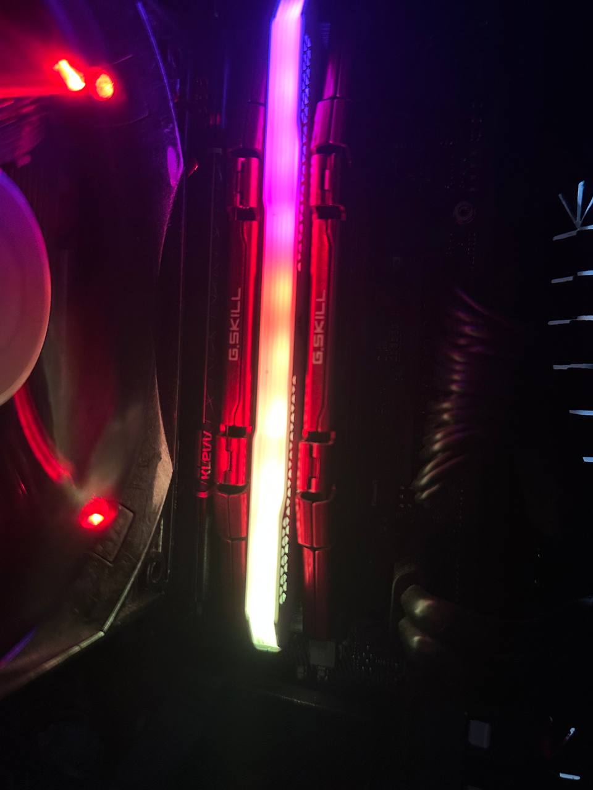
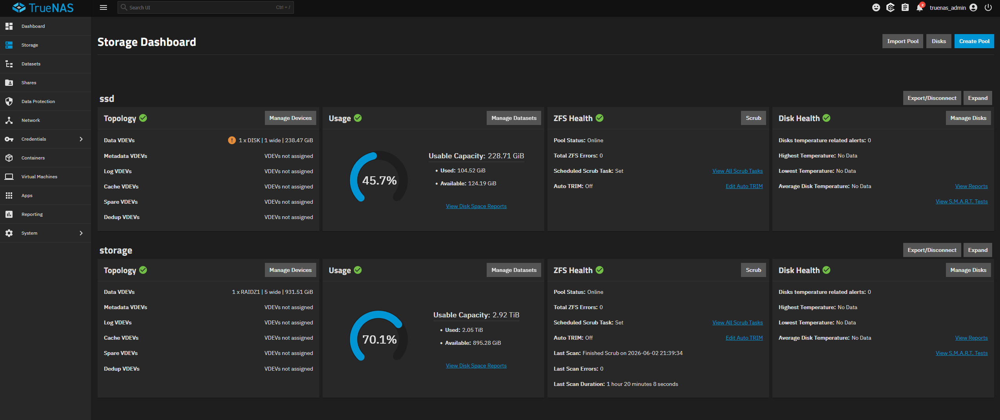
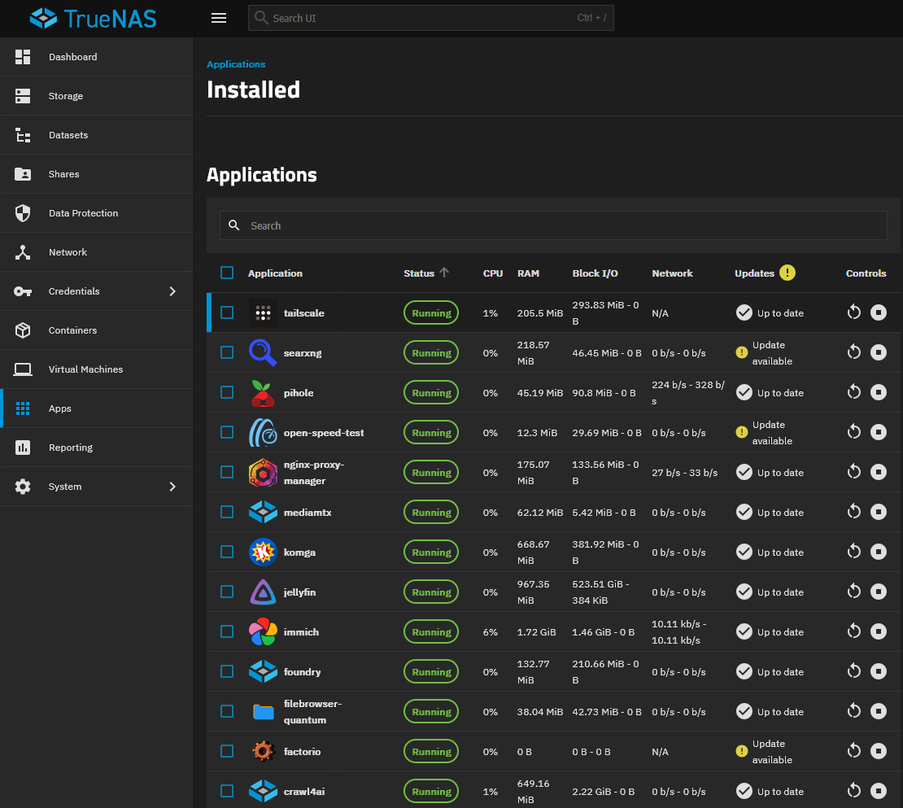
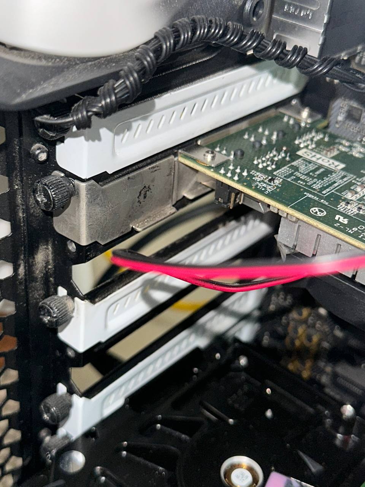
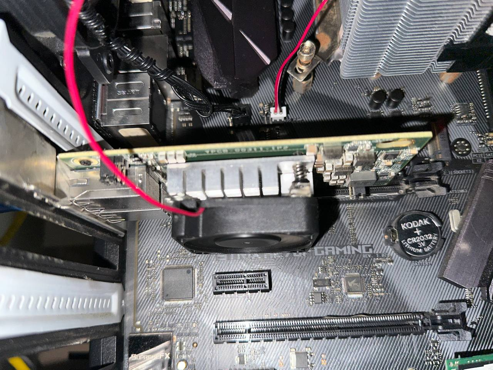
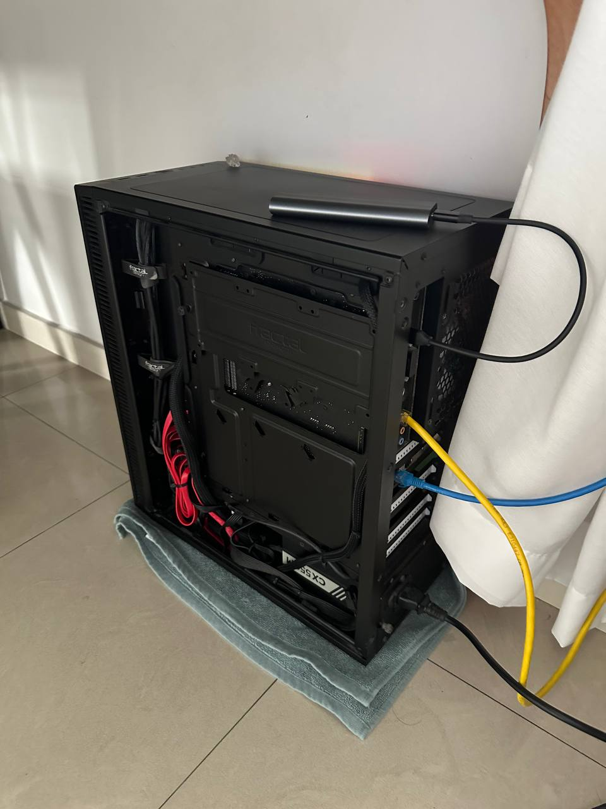
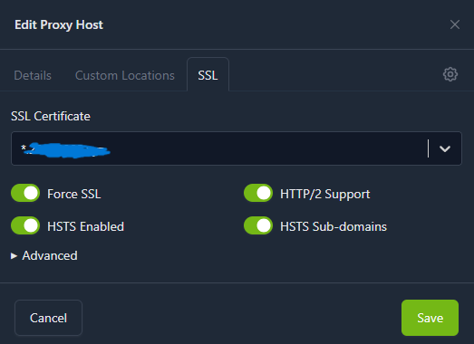
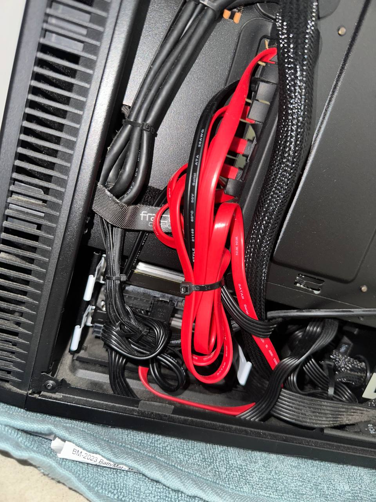
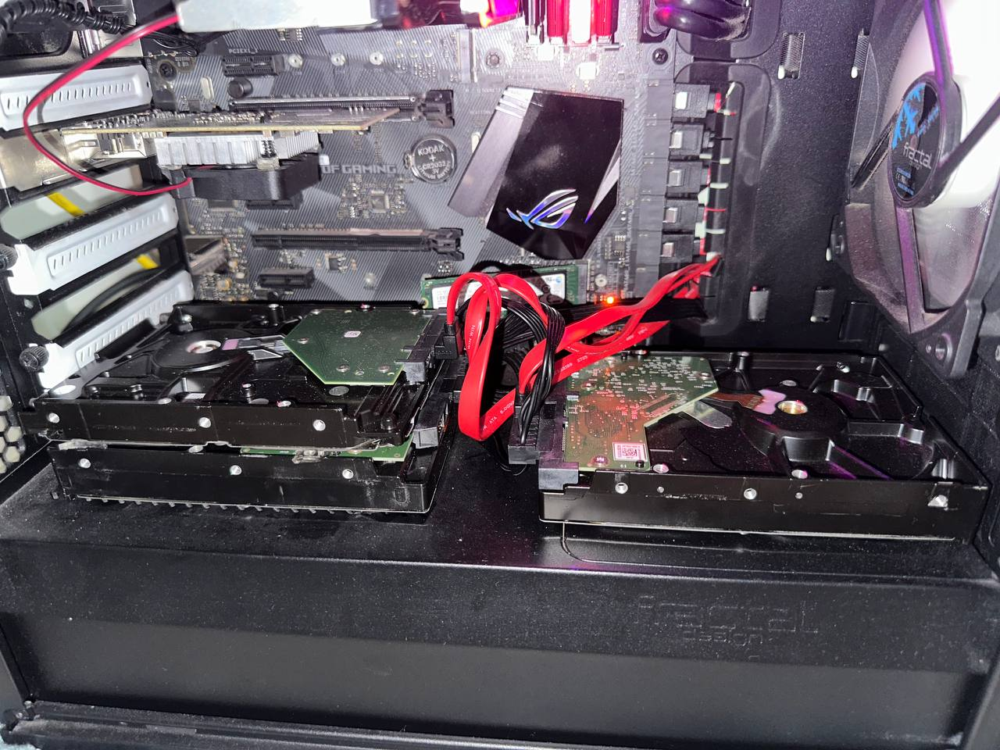

# Personal Project: Homelab Infrastructure

Built and maintained 2025-present. Documented June 2026.

---

## System

I repurposed an old desktop as my home server. Hardware that was necessary was sourced and added, mostly from Shopee, Carousell and friends. The specs are as follows:

| Component  | Detail                                                |
| ---------- | ----------------------------------------------------- |
| CPU        | Intel i5-7500                                         |
| RAM        | 32GB DDR4 2400 (JEDEC spec, mismatched manufacturers) |
| GPU        | Removed (was GTX 1060)                                |
| OS         | TrueNAS Scale                                         |
| Storage    | 5x 1TB HDD (RAIDZ1), 5-wide pool    |
|            | 1x 256GB SSD for OS                                   |
|            | 1x 256GB SSD for Docker containers                    |
| Networking | 1x motherboard 1GbE                                   |
|            | 2x 10GbE (Intel X540-T2 10GBaseT)                     |

Half of the RAM was kindly donated by friends of mine, which led to a manufacturer mismatch. In order to get around this, I had to downclock them to the lowest JEDEC spec.



Hard Drives were sourced from carousell at all under $15 per TB, as consumer drive prices have surged with AI demand. A 5-wide RAID Z1 allows for greater read throughput than a smaller array.

The SSDs were also provided by a friend, as the current SSD prices are too high, and the company he was working for just happened to be getting rid of a bunch of them.



---

## Services

| Service                         | What it does                                                                                                                                                                                                   |
| ------------------------------- | -------------------------------------------------------------------------------------------------------------------------------------------------------------------------------------------------------------- |
| **Jellyfin**                    | Media streaming. My family watches shows through it. Our TV is older (no smart features), so I connect my laptop via HDMI. I also set up automated subtitle fetching so they can watch with Chinese subtitles. |
| **Komga**                       | Comic and manga library server                                                                                                                                                                                 |
| **Immich**                      | Self-hosted photo backup (iCloud equivalent)                                                                                                                                                                   |
| **Pi-Hole**                     | DNS-wide ad blocking, local DNS records                                                                                                                                                                        |
| **Tailscale**                   | Mesh VPN for remote access                                                                                                                                                                                     |
| **NGINX Proxy Manager + Caddy** | Reverse proxy. Caddy as backup when NPM breaks on updates.                                                                                                                                                     |
| **SearXNG**                     | Self-hosted web search                                                                                                                                                                                         |
| **Crawl4ai**                    | Self-hosted web content extraction                                                                                                                                                                             |
| **MediaMTX**                    | RTSP-to-HLS stream relay (OBS to in-game video players)                                                                                                                                                        |
| **Foundry VTT**                 | Tabletop RPG sessions with friends                                                                                                                                                                             |
| **Filebrowser Quantum**         | Lightweight file sharing with anonymous upload links                                                                                                                                                           |
| **OpenSpeedTest**               | Network diagnostics                                                                                                                                                                                            |
| **Game servers**                | Factorio, Minecraft (on demand)                                                                                                                                                                                |



---

## Problems I faced

### Intel X540-T2: heat, brackets, and 10GBaseT

When I built my server, I knew I wanted to have 10Gb networking. The price of 10G network cards were beyond my expectations for this project, however. After looking on sites like Shopee, I found a listing for Inspur Intel X540-T2 cards, seemingly ripped from Chinese servers.

The Intel X540 is an EOL chipset, so I knew that I was going into this having to face problems when it came to driver support. I proceeded to buy them anyways. The journey to having 10GbE was not easy, as the chipset being EOL was the least of my worries. The card shipped with an SFF half height PCIe bracket, and had no fan. I had previously read about thermal issues with the card, but assumed that the airflow within the chassis would be sufficient for my light use case.

I initially tried using the card without the bracket, but found it to be unstable, and that it possibly caused the card to pull out from the PCIe. This led me to realise that I needed the full height PCIe bracket to ensure stability. At this point, as I was still testing, the thermal issue had not appeared yet. I proceeded to order full height brackets for standard X540 cards. However, when they arrived the port cutouts on the full height brackets did not match those on my card. The solution I ended coming to was, together with my dad, sawing the full length PCIe bracket, flattening the right angle on the half height card, and super gluing them together. This, resulted in the card fitting securely after being screwed in.



This was when the thermal issues struck. The airflow within the chassis was insufficient to cool the chipset. This resulted in overheating, and the shutting down of the network card entirely. The card would only resume functioning upon a reboot.

To solve this problem, I measured out the size of the aluminium heatsink that same with the card, and went down to Sim Lim Tower to purchase a fan that matched the requirements. I then attached the fan using a thick 3M double sided gel tape. This worked despite the heat from the heatsinks, as they were stuck to 2 plastic push screws holding the heatsink down. The fan was then plugged into the motherboard fan header, and the overheating problem was resolved.



This also made me realise, that due to the 10GBaseT nature of this card, it consumed more power, and due to the age of the chipset, produced significantly more heat as well. These problems could have been circumvented by spending more on a Mellanox or similar SFP+ card, but the price of SFP+ cards and adapters were unjustifiable for me at the time.

### 10GbE without a 10GbE switch, and its various problems

Originally, I wanted to run both my computer and my server to either a 10G switch, or my ISP AP/Router. However, this plan quickly fell through as Singtel does not offer a router for their 3/5 Gbps plans, and I was not ready to pay for 10 Gbps internet. Starhub's 5Gbps broadband plan did offer one, but me and my family felt that switching providers would not be worth the hassle.

To get around this, I had to look more into networking, and eventually found out about ethernet port bridging and bonding. I ended up connecting my PC to my Server, and having a connection from my server to my ISP Router/AP.

PC < -- 10GbE -- > Server < -- 1GbE --> Router/AP

This allowed me, after bridging the 2 ports on my server, to have a 10GbE connection to my server, while also having the 1GbE internet routed over the 10GbE connection. Upon further testing though, there were more problems.



Openspeedtest, my default testing tool, was not able to hit the full 10 gigabit speeds. I found out that this was due to the nature of how the speed test was structured, and switched to iPerf3 instead, a memory to memory test that nears theoretical speed limits when testing. This test resulted in around 4.5 Gbps. I had to perform more optimisations, specifically on my PC's side. I assumed that the network card was working fine on the server side, as many people have reported the card being "Plug and Play" when used with the TrueNAS OS. On Windows however, the device was not officially supported. I had to tweak things like Interrupt Moderation, Flow Control, TCP/UDP checksum offload, Tx/Rx buffers and RSS Queue count settings to get the full 10GbE speeds.

These settings birthed another problem however, my PC was now no longer able to handle real-time audio. Due how the card was purpose built for servers, when transmissions happened, any music I was playing would have audible "pop" sounds. After some research, I narrowed the cause down to 2 possibilities. A noisy SMB bus, or DPC latency. I quickly ruled out the noisy SMB bus, as that was something that people reported not allowing their machine to POST at all. There was no easy fix to the DPC latency issue. It took a lot of testing with LatencyMon, a software to monitor for DPC latency spikes, together with tweaking the settings that I used to fix the speed limit. After a bunch of trial and error, I finally landed on settings that significantly reduced the DPC latency and the problem was solved.

### Split DNS

During the setup of my Jellyfin Media Server, I realised I wanted my friends, many of whom lived in other countries. This led me to purchase a domain, and set up a reverse-proxy service. Out of curiosity, I tried testing the media access over my domain, to see if content loaded properly and without network issues for my friends, to check if my reverse-proxy was functioning properly. This led me to discover that access was much slower than over the local network. While this would obviously be the case, the speed and latency difference were greater than expected of even a regional route.

I booted up Openspeedtest again, once instance over the LAN, and one over my domain. The LAN result sat at a stable 1Gbps (this was before the installation of 10GbE networking), with negligible latency. The over-the-internet instance however, was reaching speeds of around 0.4Mbps, with latencies of over 500ms reaching over 1500ms in some instances.

At the time, I could not find anything online that could explain why. I assumed the problem was with my reverse proxy, as that was that last thing that I had set up. I spent quite some time tweaking SSL and HSTS, trying to figure out if there was something that I forgot to turn on or something I did not do. I even tried custom configurations like

```
# Disable buffering for the request (client to proxy)
proxy_request_buffering off;

# Disable buffering for the response (proxy to client)
proxy_buffering off;

# Allow Nginx to pass large files without limits
client_max_body_size 0;
```

That did not seem to work. Eventually, I concluded that this was simply a routing issue, and as there was nothing I could do to influence Cloudflare's routing algorithms, I decided to look for a solution for me specifically.

Upon more research, I found 2 main solutions to the problem. A Hairpin NAT, and a Split DNS. A Hairpin NAT would just use the Network Addressing Table of the router to reroute packets bound for my public IP back to my server, while a Split DNS would return the server's IP address whenever it receives a certain request.

I decided to go with the Split DNS, as I had already implemented Pi-Hole, a DNS wide adblocker, which happened to be able to function as a local DNS server as well. I configured it to route all requests to my server to be served with the local IP address, while routing other requests to Cloudflare's DNS server of 1.1.1.1. This solved the problem for me.

### Reverse proxy: from NPM to Caddy and back

During the DNS troubleshooting, as I had thought the initial problem was with my reverse proxy, I tried switching reverse proxies. From the GUI based NGINX Proxy Manager to Caddy. A super lightweight, purely config-file driven reverse proxy. This did improve performance, but I did not want to have to reboot or reload a config file everytime I wanted to switch my reverse proxy entries. It now serves as backup to my NGINX Proxy Manager, in case an update breaks anything.

The initial setup of the Reverse Proxies also taught me about SSL certs, leading me to set up a single wildcard cert for all my subdomains obtained via Let's Encrypt using a DNS-01 challenge via Cloudflare DNS validation. This was much easier than using per-subdomain SSL certs, as I was worried that I would hit Let's Encrypt's limits with the extensive testing that I was doing at the time. Once the wildcard cert was set up, it could be used for all my subdomains.



### GPU accelerated hardware encoding, not worth it

During the setup of my media server, I toyed with the idea of using the GTX 1060 I had in it at the time, to encode oversized media to save on my very limited storage. This proved to be a much more difficult feat that I had imagined, given the appliance nature of TrueNAS.

I initially tried setting up a standard handbrake container, a program that I was familiar with for the purpose of encoding videos. This container however, did not ship with support for NVENC based encoding, and only supported Intel QSV (Intel's hardware accelerated encoding platform), which was slower, and worse in every way.

To solve this, I tried pulling a container that was known for its NVENC support, only to find that the NVIDIA driver version required for this, was mismatched with the one that shipped out with TrueNAS's OS. This was a truly insurmountable hurdle, as there was no way I could update the driver on TrueNAS. This led me to give up on the endeavour altogether.

At this point, I had been running benchmarks between my laptop's GTX 1050 (same encoder chip as 1060) and my desktop's RTX 3080, to find that there was a significant gap in not only encoding efficiency, but also support for features like 10bit H.265. This led me to realise that it was not worth it to pursue encoding on my server.

One solution that I plan to implement in the future is completely switching out the motherboard and CPU, for one of the Chinese frankensteined laptop chip on ITX boards. The newer intel chips ship with ARC integrated graphics, which are capable of doing hardware AV1 encoding, the only next reasonable step for my server.

### The Nextcloud mistake

In looking for a solution for a self-hosted cloud platform, I was led to Nextcloud. What everyone seemed to agree was the de-facto solution for a self-hosted cloud platform. Trying to set it up was a pain. While I could have used the TrueNAS standard of ixVolumes, I had to map all required storage locations to an actual Dataset, as it took a lot of fiddling with configurations to get it working. Once it was working, I found it to be much too heavy for my hardware, and had to strip down some of the heavier elements in order to get it to run smoothly. On the surface, this seemed like a great solution. It felt like Google Drive, but self-hosted.

Then the problems began appearing, the first of which was a small thing, but it was something I wanted to fix no matter what. My Nextcloud links, when sent over platforms like Discord, would not embed properly. This was something that irritated me for some reason, as it used to work when I was testing it over a http link, and only stopped working when it went over https.

This led me down a rabbit hole. Consulting with LLMs, resulted me in trying to strip headers through my reverse proxy. Stripping some of the headers I thought was causing the problem did not help. It was through trial and error, examining the headers with curl commands in my TrueNAS shell, where I finally found the issue. A single `X-Robots-Tag: noindex nofollow` header that prevented the discord bot from crawling it for information. Once that was stripped, the embeds worked.

Another problem was a default upload size limit of 512Mb. I found this to be extremely underwhelming, and wanted to increase it as its main purpose was to be a fileserver. It was supposed to be an easy fix, go into the php.ini file and change the respective values, but for some reason my Nextcloud container just didn't respect the changes I was making. This made me take a step back and look at the entire thing again, when I realised what I really wanted was not some full fledged cloud suite, but just a file server.

I turned to the lighter and purpose built Filebrowser, and eventually Filebrowser Quantum, which served all my purposes of sharing files with my friends over the internet, and allowing them to upload files to my server without having to create an account.

### Physical 5-drive fit

The issues I ran into were not just purely hardware. During setup, I was running very few drives. A worn 500 GB HDD and a 3-wide 1tb RAID Z1 array. I was already having trouble fitting these into my chassis, as it was the same mid-tower case that I was using from back in the day. I ended up using a thick 3M double sided gel tape to stick the drives that did not fit in the dedicated drive bays onto the meta case shroud that went over the PSU. This worked, as the tape did not only serve to prevent movement, but also as vibration dampener, which is important to prolong the lifespan of spinning hard drives.

When this was eventually expanded into a 5-wide RAID-Z1 array, I had to look for even more space. This was however nowhere to be found, and I had to stack one drive on top of another. I tried to mitigate vibrations with the same 3M tape, which was the most I could do. Another thing I tried to maintain was having the drives sit roughly 90 degree horizontal, which was recommended operating spec for spinning hard drives. This also made it somewhat easier to connect right angled power and SATA cables to the drives.



This however, spawned temperature issues, not only for the drives on the shroud, which were getting quite little airflow on some of sides, but also the drives in the dedicated drive bays. Those had no ventilation, and as the 2 drive bays were in close proximity, amplified their heat during heavy tasks like resilvering (rebuilding the pool with a replaced hard drive) or scrubs (checksum integrity verification).

Due to the already tight fit of the drive in the case, the only realistic solution that I could think of was removing both side panels, allowing fresh air to reach both the drives in the dedicated bays, as well as the drives on the shroud. They now sit within the low 40s, well within operating spec for consumer drives.



### ZFS and SMR

One of the issues that come with being cheap, is having to either perform workarounds, or pay more in the future.

As I was not willing to shell out cash for the brand new warrantied drives, I looked to Carousell. The marketplace was largely filled with people drastically overcharging for their subpar hardware, but there were some gems. I found someone who sold 1tb drives for $12.50 each, and jumped on it. The SMART data looked relatively clean, so I bought it.

Upon installation, they actually ran fine for a while. Until it did not. Something I had overlooked was the fact that due to Seagate trying to cut costs, these drives use SMR (Shingled Magnetic Recording), compared to CMR (Conventional Magnetic Recording). This was an issue mostly for my use case as a server drive, as the SMR technology and ZFS's Copy on Write system was fundamentally incompatible. During read/write intensive operations, such as scrubbing or resilvering, the drives would falter as they were not able to keep up with long continuous operations. This was when one of the drives actually failed in my pool, leading to me having to source for replacements.

After a bit more hunting, I managed to find someone who was selling WD Blue Desktop 1tb drives, for the great price of $10 per TB. I did the standard due diligence when purchasing used hard drives, checking the manufacturing date, SMART data, power on hours, but this time, I remembered to check whether the drives were CMR or SMR. Luckily, they were the former, and I purchased a few of them, expanding my pool to 5-wide. The drives have been functioning fine so far.


### MediaMTX: RTSP streaming through a reverse proxy

Another problem I faced was when I was playing games like VRchat. There was no dedicated way to perform a screenshare through the well-established video players in the game, as they are mostly yt-dlp (video ripper) based. One solution I thought of, was leveraging my own server. I could set it up as a streaming server, and now that I had a domain, I could put my streams on the video players through that.

Setting it up required me to look at how streams are handled, through protocols like RTSP, RTMP, HLS and WebRTC. At first, it was not working, which made me delve deeper into the configuration, which was hard, as there was a lot of conflicting advice online

Some said RTSP does not work over a reverse proxy, and some said it would work over NGINX Proxy Manager, as it has a stream function. None of these seemed to work for me. After further investigation, I found out that mediamtx, the streaming server I used, actually only used rtsp for the stream ingest from OBS. The solution that I ended up with was actually adding an index.m3u8 at the end of the link, which output an HLS Multivariant Playlist. This finally allowed the stream to work in game.
